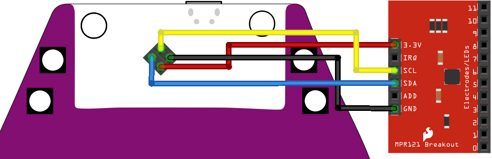

# Touch-Piano

Turn your Badge into a tiny piano with an external touch controller!

## Required Hardware

You'll need an MPR121 Capacitive Touch Breakout Board. They are cheap and widely available:
* [Adafruit for $7.95](https://www.adafruit.com/product/1982)
* [AliExpress for ~$1 USD](https://www.aliexpress.com/wholesale?SearchText=mpr121+breakout)

## Hardware Setup

1. Connect the hardware as shown:

## App Installation

1. Copy `code.py` and `music.bmp` to your badge drive. 
2. Copy all the files from the [../lib](lib) directory to your badge drive

Usage:

1. Connect headphone or an external speakers to the audio jack
2. Touch pins 0 to 7 of the MPR121 breakout to enjoy some music!

## Copyright

Copyright (C) 2019, Uri Shaked. Code and documentation released under the
MIT license.